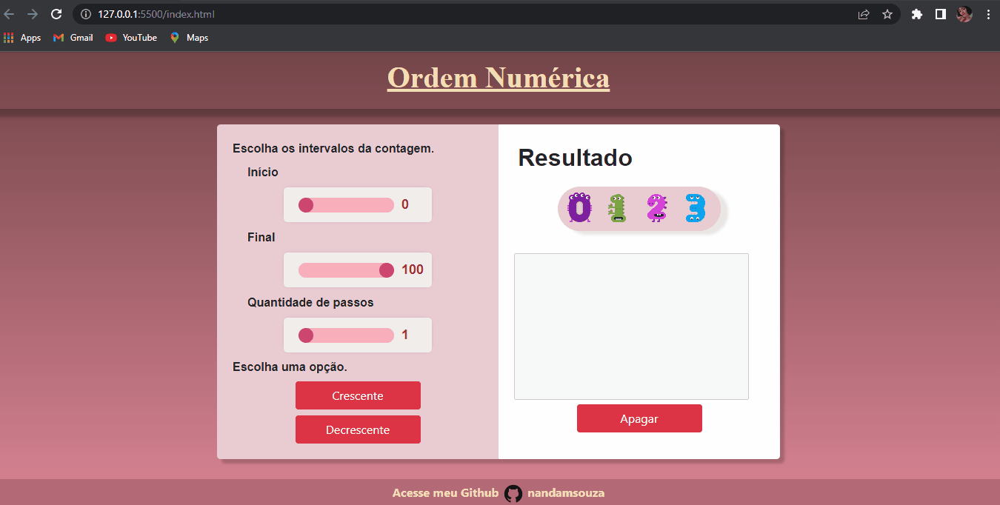

<html>
    <h1 align="center">Ordem Númerica</h1>
    
O projeto foi desenvolvido com a intenção de aprimorar meus conhecimentos em CSS e JAVASCRIPT. Nele você pode gerar uma ordem crescente e decrescente de um determinado intervalo.

    <h2>⚙️FERRAMENTAS UTILIZADAS NO PROJETO:</h2>
    <ul>
        <li>HTML</li>
        <li>CSS</li>
        <li>JAVASCRIPT</li>
        <li>BOOTSTRAP</li>
        <li>VSCODE</li>
    <ul>
    <h1>🔎 Demonstração do projeto</h1>
    
    
 Veja meu Projeto 👉 <a href=" https://nandamsouza.github.io/numeros/" target="_blank">Link</a>

</html>